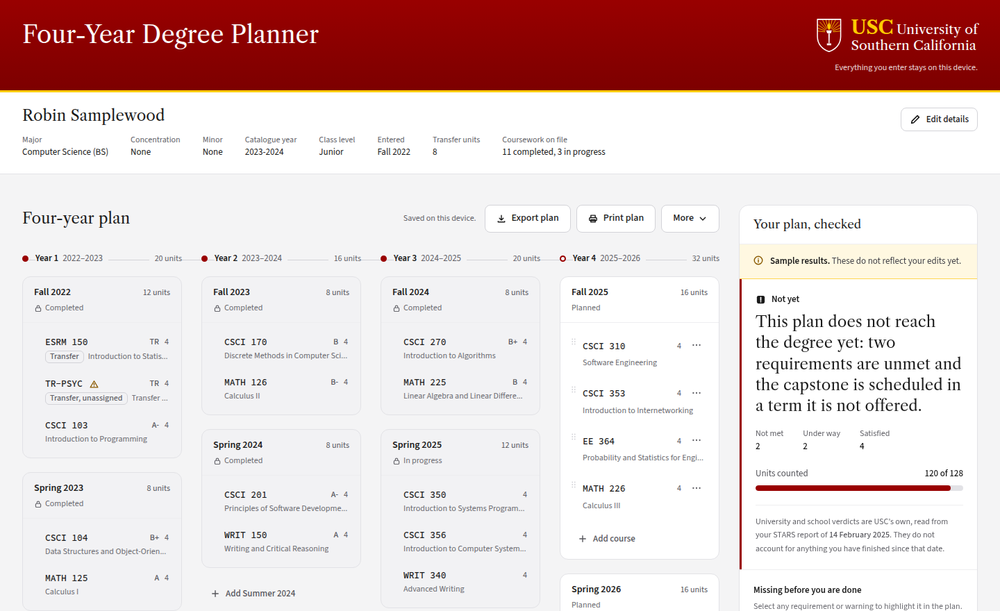

# Four-Year Degree Planner

Lay out the next four years of coursework and see whether the plan actually
reaches the degree — what is already satisfied, what is still missing, and which
courses are scheduled in a term they are not offered.



Everything runs in the browser. No account, no server, no upload.

> This is **not** the Next-Semester Validator (`validator/`). There is no
> "can I register for these classes next term" screen here, and there should
> never be one — that tool is Tanzil's and it answers a different question.

---

## Try it

Needs Node 20.19+ or 22.12+ — what Vite 7 requires.

```bash
cd degree-planner
npm install
npm run dev
```

Open the URL it prints and click **Try it with a sample student**. Nothing is
saved as yours, and **Clear all data** wipes the device clean.

| Script | What it does |
| --- | --- |
| `npm run dev` | Local dev server |
| `npm run build` | Typecheck, then build the static site into `dist/` |
| `npm run preview` | Serve the built `dist/` locally |
| `npm test` | Unit and component tests (82) |
| `npm run test:e2e` | Browser tests against the production build (12) |
| `npm run lint` | ESLint |
| `npm run typecheck` | Two passes — `src/` with browser types, `test/` and `e2e/` with Node's |
| `npm run check:privacy` | The privacy and platform guardrail |

## What it does

- **Start three ways** — upload a STARS report, enter details by hand, or open
  the sample student.
- **A four-year timeline** built from the report: completed and in-progress
  terms are locked, planned terms are editable. A term is locked because its
  data says so, never because of today's date.
- **Move courses** by dragging, or through a *Move to…* menu that does the same
  job from the keyboard.
- **An audit panel** — verdict first, then what is missing with a reason for
  each, then warnings. Select any requirement and the courses it refers to light
  up in the plan.
- **Transfer credit shown for what it is**: credit matched to a USC course can
  fill a requirement, generic credit only adds units.
- **Export, import and print.** The export file carries no name in its filename;
  the printed page is a black-on-white plan an advisor can mark up.

## Built with

| Layer | Choice | Why this one |
| --- | --- | --- |
| Build | Vite 7 | Static output, no framework server half to accidentally depend on |
| UI | React 19 + TypeScript 5.9 | Strict mode, `exactOptionalPropertyTypes`, `noUncheckedIndexedAccess` |
| Styling | Tailwind v4 (`@theme`) | One token file; no arbitrary font sizes or colours in components |
| Drag and drop | `@dnd-kit/core` | Pointer sensor only — the *Move to…* menu is the accessible path, not a fallback |
| Tests | Vitest + Testing Library | Queries by role and label, so the tests fail when the a11y tree breaks |
| Browser tests | Playwright + axe | The real production build, including a WCAG 2.1 AA sweep |
| Type | Libre Caslon Text, Source Sans 3, Source Code Pro | Self-hosted via `@fontsource`; matches USC's registration pages |

Colour, radii and shadows are lifted from `validator/validator_gui.jsx` so the
two tools look like one product; the source value is noted beside each token in
`src/styles/index.css`.

## Built under four rules

**1. Student data never leaves the browser.** No backend, no analytics, no
third-party script, no runtime font CDN. Exactly one module,
`src/data/catalogue.ts`, may make a network request, and all it requests is
public course data shipped with the build. `npm run check:privacy` fails if
anything else in `src/` gains a `fetch(`, `XMLHttpRequest`, `sendBeacon`,
WebSocket, `<script src=`, `process.env`, a `node:` import, a Node global, or a
server entry point — and if an analytics package appears in `package.json`. The
type system backs it up: `src/` is compiled with browser types only.

**2. No degree logic lives in this app.** `parseStarsReport` and `analyzePlan`
are stubs that ignore their arguments and return fixed objects. No requirement
checking, no prerequisite rules, no offering-term rules, no unit-load rules —
not in the stubs, not anywhere. `test/stubs.test.ts` proves it by asserting two
materially different plans produce a deeply equal result.

**3. Every invention is marked where it happens.** Anything built because nobody
had specified it carries a one-line `GAP(stars|analysis|catalogue|other)`
comment at that exact spot. `grep -rn "GAP(" src` lists them all;
[`docs/degree-planner-ui-notes.md`](../docs/degree-planner-ui-notes.md) is
written from that list and holds only questions that are still open.

**4. No check is ever weakened to make it pass.** No `any`, no `@ts-ignore`, no
`eslint-disable`, no skipped test, no loosened tsconfig. When axe found a
contrast failure the palette changed, not the threshold.

## Where its data comes from

The planner owns no facts of its own. Each seam follows the producer's own
README, and a test fails if either side drifts.

| What | Whose | Contract |
| --- | --- | --- |
| The parsed STARS report | Abhi — `stars-parser/` | [`stars-parser/README.md`](../stars-parser/README.md) |
| The sample student | shared | [`fixtures/stars/mock_stars_report.json`](../fixtures/stars/mock_stars_report.json) |
| Which verdicts are reused vs computed | Natalie — degree-audit engine | [`docs/reference/03`](../docs/reference/03-degree-planner-architecture.md) |
| Course titles, units, offering frequency | Agastya — `catalog/` | [`catalog/README.md`](../catalog/README.md) |
| The `stars_summary` slice | Tanzil — `validator/` | [`validator/README.md`](../validator/README.md) |

Components import shapes from `src/domain/types.ts` and never from a stub's
internals, so dropping in a real implementation is an import change inside
`src/data/` and nothing else.

## Checks that would otherwise be opinions

| Check | What it pins |
| --- | --- |
| `test/contracts.test.ts` | The sample student against the committed shared fixture, read off disk. Also records that fixture's own class-level contradiction — see **P0** in the notes. |
| `test/catalogue.test.ts` | The course file against `catalog/README.md`: all ten documented fields, `term_code` matching its key, `offering_frequency` agreeing with the terms each course appears in. |
| `test/contrast.test.ts` | Every text colour against every surface at WCAG AA, in milliseconds, without a browser. |
| `e2e/accessibility.spec.ts` | axe over six screens at WCAG 2.1 A and AA, on the real build. |
| `test/stubs.test.ts` | That the stubs are still stubs. |
| `scripts/check-privacy.mjs` | The privacy and platform rules, including both deploy configs. |

## Layout

```
src/
  domain/       types.ts is the contract; terms.ts is display arithmetic only
  data/         the two stubs, the catalogue module, the sample student
  state/        one store for situation + plan, versioned persistence
  features/
    situation/  upload, sample, manual entry, review form, summary bar
    plan/       the timeline, course picker, move menu, drag and drop
    audit/      verdict, requirements, warnings, cross-highlighting
    toolbar/    export, import, print, reset, clear
  components/   shared primitives and the status system
```

## Deploying

A plain static site — the same `dist/` works anywhere, and both configs are
committed so an import needs nothing typed in by hand.

- **Vercel** — set **Root Directory** to `degree-planner` and import.
  [`vercel.json`](vercel.json) supplies the rest.
- **Netlify** — set **Base directory** to `degree-planner` and deploy.
  [`netlify.toml`](netlify.toml) supplies the rest.

Both send a `Content-Security-Policy` allowing scripts, styles, fonts, images
and data from the app's own origin and nothing else, with `form-action 'none'`
and `frame-ancestors 'none'` — rule 1 restated in a form the browser enforces.
`check:privacy` reads both files and fails on any block that would give this app
a server half.

## Open questions

[`docs/degree-planner-ui-notes.md`](../docs/degree-planner-ui-notes.md) — 18
questions, each addressed to the person who can answer it. Start with **P0**:
the shared fixture states `"classLevel": "Junior"` for a student with 36 units
earned, and `docs/reference/01` puts junior at 64–95.9. Both the parser suite
and the validator suite assert against that student.
